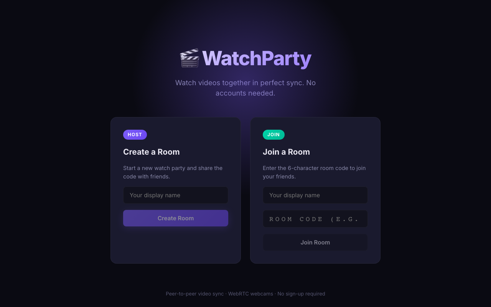

<div align="center">
  

  <h1>WatchParty — Watch Together</h1>
  <p>Watch videos together in perfect sync with friends. No accounts needed. WebRTC webcams and real-time chat.</p>

  <p>
    <a href="https://watchparty-nu.vercel.app/" target="_blank"><strong>View Live Demo »</strong></a>
  </p>
</div>

---

## ✨ Features

- **🎥 Perfect Synchronization**: Watch videos with friends in real-time. Pauses, rewinds, and skips are instantly synced across all peers.
- **📷 WebSockets & WebRTC**: Experience ultra-low latency webcam, audio, and peer-to-peer data streams using `simple-peer`.
- **💬 Real-Time Chat**: Interactive room-based messaging powered by Socket.io.
- **🚪 Frictionless Rooms**: Instantly create and join rooms using shareable links without any account registration or hurdles.
- **🔒 Secure Backend**: Reliable REST API & WebSocket server handling presence and room state.

## 📸 Screenshots

### Home & Room Creation

*Start a party easily by entering a room code or joining an existing one.*

### Interactive Watch Room

*Enjoy video playback combined with real-time video, audio, and chat.*

## 🚀 Tech Stack

### Frontend
- **React 19** with **Vite** for incredibly fast HMR and optimized builds.
- **React Router v7** for seamless Single Page Application routing.
- **Socket.io Client** built for realtime bidirectional event-based communication.
- **Simple-peer** abstraction for WebRTC peer-to-peer data, video, and audio calls.

### Backend
- **NestJS 11** — a progressive Node.js framework for building efficient, reliable, and scalable server-side apps.
- **Socket.io / WebSockets** for low-latency signaling between peers.
- **TypeORM & PostgreSQL** for persistent room and state management.
- **AWS S3** integration for robust media and file hosting integrations.

## 💻 Local Development Setup

To run the project locally, you will need **Node.js 20+** installed on your machine.
This project is structured as a monorepo consisting of frontend and backend applications.

### 1. Clone & Install
```bash
git clone https://github.com/drecothea/watchparty.git
cd watchparty

# Install Frontend dependencies
cd apps/frontend
npm install

# Install Backend dependencies
cd ../backend
npm install
```

### 2. Environment Variables
Copy `.env.example` to `.env` in the backend directory and configure your PostgreSQL database credentials and AWS S3 properties.

```bash
cd apps/backend
cp .env.example .env
```

### 3. Run the Servers

**Backend:**
```bash
cd apps/backend
npm run start:dev
```

**Frontend:**
```bash
cd apps/frontend
npm run dev
```

The frontend will be available at `http://localhost:5173` and the backend WebSocket server at `http://localhost:3000`.

## 🚢 Deployment

The frontend of this application is automatically deployed on **Vercel**, and the backend is containerized and hosted using a custom CI/CD pipeline on **AWS EC2**. Read more about our deployment pipeline in the `.github/workflows` directory.
